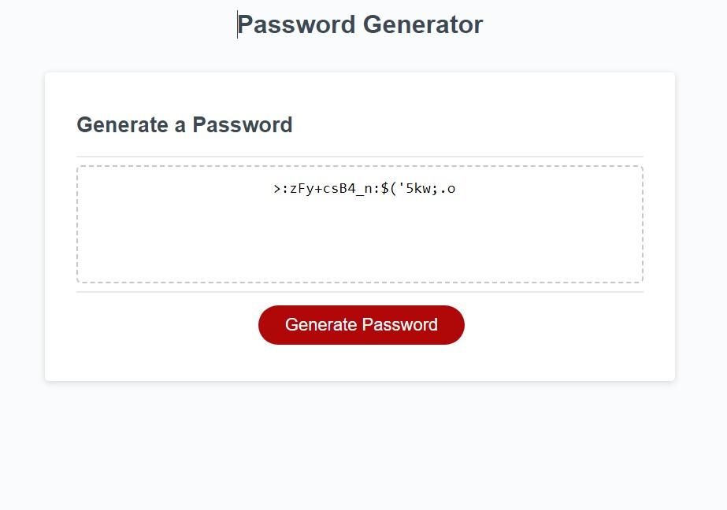

# Random Password Generator

## Description

This password generator application was created to give users another simple option to randomly create passwords for themselves based on their selected criteria. This application
is quick and easy to access, requires no login, and generates a new passowrd after answering a few prompts. Users need strong passwords to pair with login information in order to keep
accounts and personal data safe on the internet. This app is an easy way to get a random password, without much thought, that can meet a variety of common password requirements.
In creating this application, I learned multiple ways to use prompts and alerts to communicate with a user. I also learned more about grouping (concatenating) arrays and how to make this data
interact with functions in order to get the intended results.

## Usage

1. Navigate to the deployed page.
2. Click the 'Generate Password' button.
3. Follow the prompts all the way through.
4. Get your new, random password based on the criteria selected.

## Credits

-Source Code:
https://uci.bootcampcontent.com/UCI-Coding-Bootcamp/UCI-VIRT-FSF-PT-03-2023-U-LOLC/-/tree/main/03-JavaScript/02-Challenge

## Links

-Deployed Application:
https://dsoda86.github.io/password-generator/

-GitHub Repository:
https://github.com/dsoda86/password-generator

